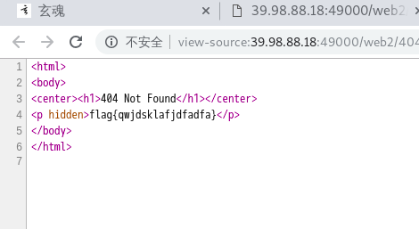
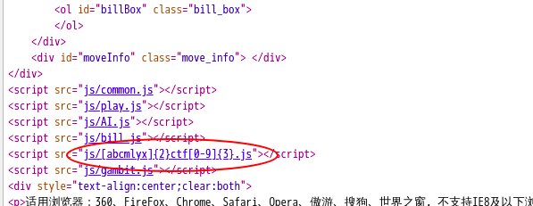
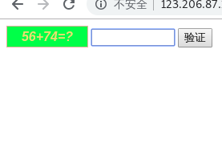
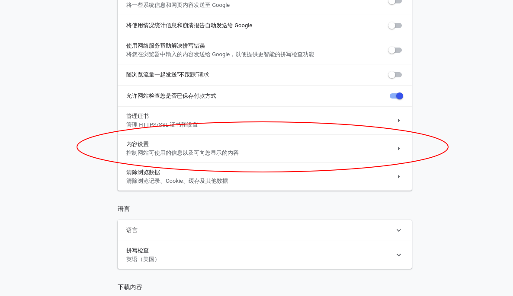
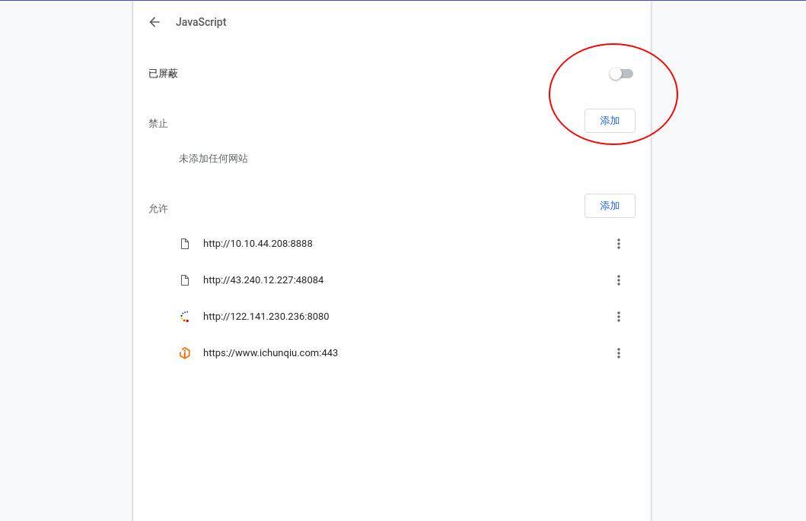

# 1.2 前端基础

## 1.2.0 前言

本次讲从实战的角度去讲解关于的html、css、以及javascirpt CTF实战题的做法。在我们浏览网页的过程中，html、css、javascript代码回直接发送到我们的客户端。故此类试题比较简单。

## 1.2.1 内容、展现和行为

前端代码的运行环境是浏览器，标准的前端语言只有Html、Css和Javascript。一般情况下，这些代码保存在服务端，通过http（https)传输到浏览器上。Html定义了要显示的内容，文档结构，可以理解为骨架。CSS定义了显示的样式，可以理解为衣服。 想要执行动态更新样式，响应用户操作，和服务端交互，都需要JavaScript。

一篇文章不能讲述所有基层内容，希望大家去找相关的入门教程学习。

因为代码都是拉取到浏览来解析执行的，所以针对前端代码的任何加密和防护手段在浏览器端都是无效的。学会通过浏览器来完成渗透测试任务是必要的基本功。以Chrome为例，其开发者工具非常强大，可以动态修改内容，调试JavaScript，进行性能、安全性测试，配合代理可以完成任何前端任务。这里推荐一个官方教程的翻译版：

https://www.css88.com/doc/chrome-devtools/

下面就CTF中一些前端入门题目做简要的分析。

## 1.2.2 查看源码

此类型试题比较简单．一般在浏览器网页上点击右键，然后选择查看源码即可发现flag或者题目线索。 
比如玄魂CTF平台上的"404 not found"右键查看源码后即可发现flag. 
 
 
２.查看引用文件
有时可能需要点击网站引用css文件或者其他引用文件才会发现提示信息或者flag。

## 1.2.3 操作js

### 直接查看

通过直接查看。即可获取到flag.     
 

### 修改js

有些试题可能通过js来限制用户的某些输入，比如限制输入的长度。比如下面这道题。 
   
根据提示进行计算，却发现只可以输入一位。摁F12。
     
发现其限制最大输入长度为一位。点击进行修改。  
     
修改为1０，然后重新输入计算结果。验证成功。        
 

另外在调试阶段，我们可以通过在控制台直接修改变量值。详情查看上面推荐的chrome开发者工具的教程.

### 禁用js

有写网站仅仅使用js做校验。比如文件上传时限制文件类型。此时我们可以直接禁用js来绕过。 
比如靶场的第一关 
右键查看源码，发现它是通过js来做上传文件的校验。    
     
上传一个木马文件,发现禁止上传。仅允许上传图片文件。　　　　
                      
浏览器禁止js运行。谷歌浏览器，点击右上角的三个点点。然后选择设置。 　　
  
滑到底，然后选择高级。 
            
下滑，点击内容控制。 
 
点击javascript. 
 
点击右上方的开关。将其屏蔽掉。 
 
然后我们再一次的上传木马，上传成功。 
 
右键查看源码，发现文件路径 

## 1.2.３课后习题

1.[html查看源码](http://39.98.88.18/challenges#HTML%E7%AD%BE%E5%88%B0%E9%A2%98)  
2.[查看css文件](http://39.98.88.18/challenges#html2)   
3.[修改查看js](http://39.98.88.18/challenges#jsjsjs)  
4.[禁用js](http://39.98.88.18/challenges#%E7%A6%81%E6%AD%A2js) 
  禁用js靶场地址：http://39.98.88.18:8080/upload/Pass-01/index.php

## 小结

CTF（web和内网渗透系列教程）的清单请在“https://github.com/xuanhun/HackingResource” 查看，定时更新最新章节链接

答疑、辅导请加入玄魂工作室--安全圈，一起成长探讨更私密内容。微信扫码了解详情：

及时获取更多消息，请关注微信订阅号

