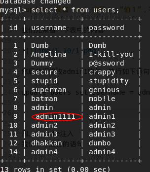

sql注入之update注入
===
一、免责声明
---
该课程中涉及的技术只适合于CTF比赛和有合法授权的渗透测试。请勿用于其他非法用途，如果作于其他非法用途，与本文作者无关。

二、靶机地址
---

>http://39.98.88.18:8080/sql/Less-17/

三、基础知识
---
update语句用来修改mysql数据表中的数据，使用方法如下：

>update 表名　set 字段１＝“值１”，字段二＝"值２" where 指定要修改的行；

我们先来看一下表中的内容

然后我们修改admin1的值，执行如下语句:

update users set username = admin1111 where id =9;

我们在看一下表的内容

四、update注入
我们一下后台的语句
｀｀｀

｀｀｀
