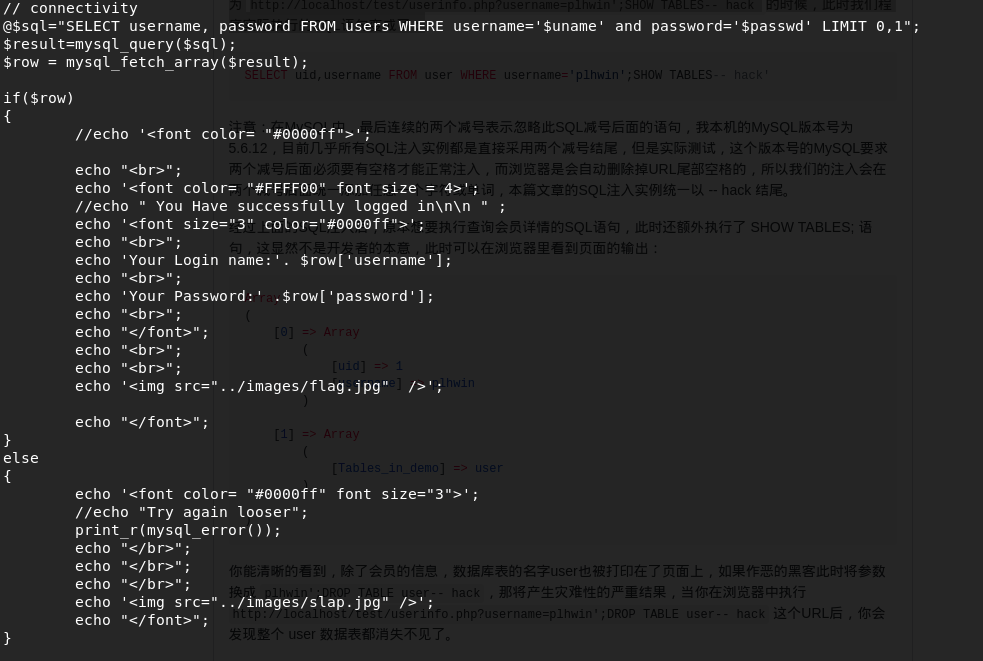
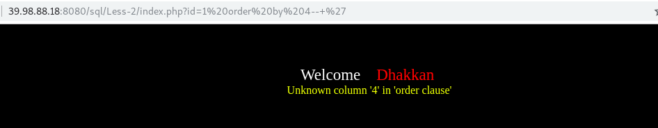

<!--
author: maomao
date: 2019-01-22
title: 2.2 SQL注入原理篇
category: web安全入门
status: publish
summary:本章节主要讲解sql注入的基本原理。如果是初次学习sql的同学建议好好的学习此篇章
-->

#SQL注入之原理篇

##免责声明

该课程中涉及的技术只适合于CTF比赛和有合法授权的渗透测试。请勿用于其他非法用途，如果作于其他非法用途，与本文作者无关。

##前言

本章节主要讲解sql注入的原理。如果是初次学习sql的同学建议好好的学习此篇章。在笔者看来，sql注入对于初学者来说，最难的莫过于对于sql注入过程的理解。很难明白为什么这一步要这样。接下来会基础上节课程中的整形注入，来详细的讲解每一步的原理及其作用。如果有不懂的同学可以随时在群里提问，或者百度学习。

##一、web程序的三层架构

web程序可以分为三层：

- 表示层

- 业务逻辑层

- 数据访问层

每一次的功能如下所示：

表示层：展示html内容，并向业务逻辑层发送请求。

业务逻辑成：加载并执行代码、向数据访问层发送请求、向表示层发送HTML代码

数据访问层：执行sql语句并将结果返回业务逻辑层。

拓扑图如下（图片来自网络）

##二、进行一次注入服务器端的流程

我们以判断注入的链接为例。链接如下：

>http://39.98.88.18:8080/sql/Less-2/index.php?id=1'

- 我们在浏览器中输入此链接，便成功链接到玄魂的靶场服务器。

- 业务逻辑层的web服务器从本地存储中加载index.php脚本解析，并接受参数。

- 脚本连接数据库系统，并执行sql语句

- 数据访问层的数据库管理系统返回sql语句的执行结果给web服务器

- 业务逻辑层的web服务器将web页面封装成html的格式发送给表示层的web浏览器。

- 表示层的web浏览器解析html文件，讲内容展示给用户

##三、sql注入产生原因

由上可知，当我们访问动态网页时，web服务器会向数据访问层发起sql查询请求，如果权限验证通过就会执行我们的sql语句。

这种网站内部直接发送的Sql请求一般不会有危险，但实际情况是很多时候需要结合用户的输入数据动态构造 Sql 语句，如果用户输入的数据被构造成恶意 Sql 代码，Web 应用又未对动态构造的 Sql 语句使用的参数进行审查，则会带来意想不到的危险。

通俗的来说：就是用户输入的时候，通过输入恶意sql语句，达到更改后台的预定的执行语句，以达到某些特定目的。比如以前常见的万能密码。

题目地址:http://39.98.88.18:8080/sql/Less-11/index.php

如图这是一个登录界面，但是我们不知道其用户名密码是什么，那我们该如何登录呢?

我们在用Username和Password处分别输入:

>admin

>1' or 1=1 #

发现此时登录成功。此时我们查看一下网站源码。

可以发现讲代码的结构大致为：讲sql语句带入数据库查询，如果结果为真，则登入成功，输入登录的账号密码，否则登录失败。

但是我们输入的语句并不是正确用户名密码。也可以登录成功，说明"1' or 1 = 1 #" 这个语句修改后台预定语句的功能。

查看网站后台源码。发现后台语句如下：

我们讲我们刚刚输入的用户名密码带入其中:

>SELECT username, password FROM users WHERE username='12312' and password='1' or 1=1 #' LIMIT 0,1

or : OR运算组合了两个或者两个以上的布尔表达式，当任一条件为真时，返回真。

'#' :　表示注释，后面的语句不执行。

and 的优先级高于or，即and语句先执行。因为1=1恒为真，所以不管and语句的结果是啥，最终结果都为真。

由上可知，上述语句为真。即我们在不知道用户名密码的条件下也可以登录成功。

此时，再看第一句话：1' or 1=1 # 为我们输入的语句，然后上述语句为我们通过输入修改后台预定的sql语句后的语句。然后我们达到了我们的目的成功登录。

所有的sql注入的原理都是这样，所不同的是，构造注入语句的不同。

##四、sql注入的基本函数

1. version()——MySQL 版本

2. user()——数据库用户名

3. database()——数据库名

4. @@datadir——数据库路径

5. @@version_compile_os——操作系统版本

6. concat(str1,str2,...)——没有分隔符地连接字符串

7. concat_ws(separator,str1,str2,...)——含有分隔符地连接字符串

8. group_concat(str1,str2,...)——连接一个组的所有字符串,并以逗号分隔每一条数据

9. UNION 操作符用于合并两个或多个 SELECT 语句的结果集,使用UNION语句进行查询时需要注意以下几点：

>- union前后的两个sql语句选择的列数必须相同才可以。同时列也必须有相似的数据类型。

>- 当两个sql语句进行联合操作时，当前一个语句选择的内容为空，这时候才可以讲后面的语句执行后的结果显示出来。

10.  information_schema这个库我们以前讲过，接下来讲解再注入的过程中常用的几个语句：

>- 猜数据库　select schema_name from information_schema.schemata

>- 猜某库的数据表   select table_name from information_schema.tables where table_schema=’xxxxx’

>- 猜某表的所有列   Select column_name from information_schema.columns where table_name=’xxxxx’

>- 获取某列的内容   Select xxx from xxx

##五、注入步骤讲解

###3.1、判断注入点

####1.原理

并不是所有的网站都能注入，只有存在sql注入漏洞的网站才可以。判断注入点的意思就是来判断是否存在注入漏洞。由上可知，sql注入就是将恶意的sql语句带入数据库中执行。判断注入点就是判断在浏览器端输入的构造的语句sql语句能否带入数据库执行。

####2.实例

通常是在链接的最后加一个单引号，当然并不是唯一，判断方法很多。为方便大家理解，我们此处以单引号为例。

加上单引号后链接为：

>http://39.98.88.18:8080/sql/Less-3/index.php?id=1'

查看后台sql语句如下：

由此可以带入数据库中执行的语句为

>SELECT * FROM  users where id=1' LIMit 0,1;

数据库报错的语句如下：

本应该将上面的语句带入数据库执行，但是由于单引号的原因无法执行。具体原因探索中。。看一下上面报错语句的图片，与网站上报错的语句大致相同。可以得知，网站上就是讲数据库中的报错显示了出来。说明我们的单引号，带入了数据库中执行。说明此处存在注入。

####3.更多方法

整形注入一般直接加单引号即可。字符型注入需要先进行闭合。具体的方法在后面的课程详细讲解。

###3.2分析报错语句

>You have an error in your SQL syntax; check the manual that corresponds to your MySQL server version for the right syntax to use near '' LIMIT 0,1' at line 1

我们刚刚在id=1后面添加了一个单引号，此时在后台执行的sql语句为：

>select * from table where id=1'

报错语句中一共有三个引号，其中最左侧，和最右侧的两个引号是语句中为了标明错误的。与后台执行的语句中。剩下的那个引号是我们刚刚自己的添加的。此时，便可以判断这个漏洞为整型sql注入。

单引号字符型的报错语句如下：

>You have an error in your SQL syntax; check the manual that corresponds to your MySQL server version for the right syntax to use near ''1'' LIMIT 0,1' at line 1

由上面的分析方法可知除去最外面的两个，以及一个自己添加的。剩下的是单引号，所以可以判断是字符型单引号报错。

### 3.3判断列数

因为union联合查询要求前后两个语句的列数相同，所以使用union联合查询以前需要判断列数。判断列数的语句如下：

> http://39.98.88.18:8080/sql/Less-2/index.php?id=1 order  by 3--+

方法就是不断的增加order by 后面的数字。如果 order by后面的数字超出列数，则会报错，根据报错来来判断。

http://39.98.88.18:8080/sql/Less-2/index.php?id=1 order by 3--+

http://39.98.88.18:8080/sql/Less-2/index.php?id=1 order by 3--+

由此可以得知，列数为3

####3.4union语句使用

>http://39.98.88.18:8080/sql/Less-2/index.php?id=-1 union select 1,2,3 --+

这里解释一下id=-1. union语句执行有一个条件是当前面语句的查询结果为空时，才会执行后面的语句。就是说当id=-1带入数据库中查询时，返回的结果为空，然后执行我们后面构造的语句。

##六、课后习题

本次课程无ctf练习题，但是需要大家掌握并理解本章节知识点。

##七、小结

CTF（web和内网渗透系列教程）的清单请在“https://github.com/xuanhun/HackingResource” 查看，定时更新最新章节链接

答疑、辅导请加入玄魂工作室--安全圈，一起成长探讨更私密内容。微信扫码了解详情：

及时获取更多消息，请关注微信订阅号

