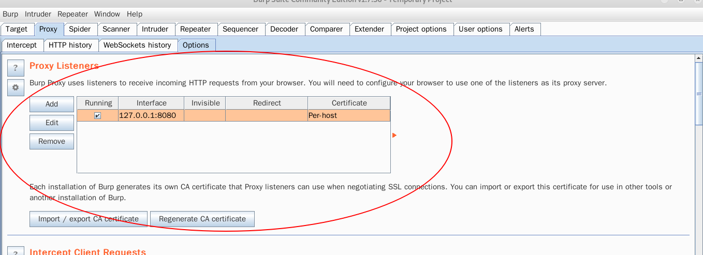
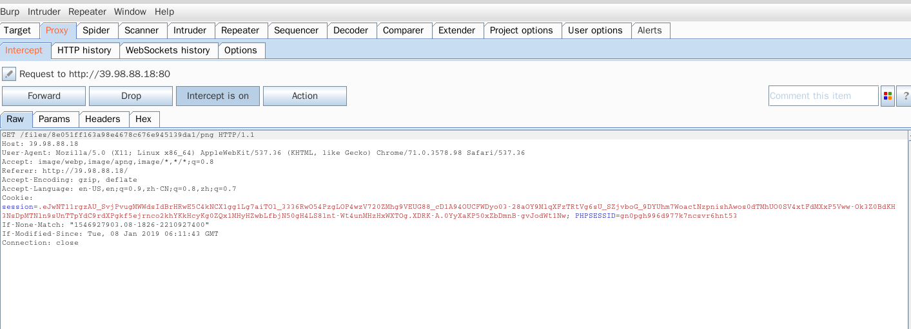
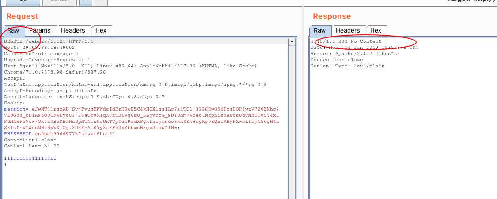
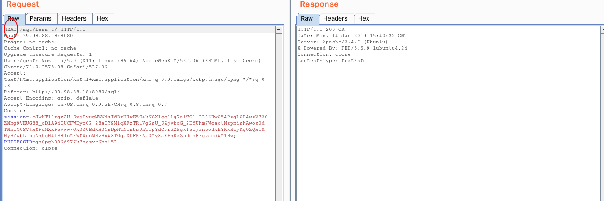
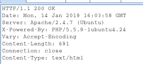

<!--
author: maomao
date: 2015-07-30
title: 1.1HTTP入门
category: web安全入门
status: publish
-->


#<center>WEB和内网渗透(CTF)</cneter>
##前言
非常高兴能够和大家相遇在知识星球。在接下来的时间里，将由我同大家一起学习web安全的基本知识。<br>
首先给大家介绍一下我们的课程。我们课程的目录稍后会以文件的形式发布在星球里，到时候大家自行下载观看。我们的授课讲采用图文＋CTF实战的方式进行。每次教程讲解一个知识点。然后会把相应知识点的CTF实战题放到我们玄魂工作室的CTF平台上，供大家实战操练。本次课程旨在帮助大家快速理解和掌握这些渗透测试中的基本知识，同时更加快速的入门和进步。<br>
大家有任何的建议和意见，可以随时在知识星球内向我提问。或者可以邮箱联系我XuanHunwebCTF@163.com<br>
##第一章：web基础
###第一节：HTTP协议
####1.0协议
协议指的是通信网络中两台计算机之间进行通信所必须遵守的的规则或者规定。
####1.1HTTP协议简介
HTTP(HyperText Transfer Protocol)即超文本传输协议。它详细规定了浏览器和web服务器之间的通信的格式，是万维网交换信息的基础。
####1.2url（统一资源定位符）
HTTP协议中永远都是客户端发起请求，服务端返回响应。即如果客户端没有请求，即服务端无法将消息发送给客户端。<br>
那么我们如何才能够发起一次HTTP请求呢？<br>
我们打开浏览器，在其上方输入一个URL(eg:www.baidu.com)并按下回车键，很快我们便收到了这个请求的响应结果。
>URL(统一资源定位符）又称网页地址。就如同现实世界中的门牌号一样，它是网络上的门牌号。通过它我们可以到网络上任意一个公开的web服务中寻找我们需要的信息。<br>　

接下来我们将详细的介绍一下url各个字段的含义。例如:<br>
http://zh.wikipedia.org:80/w/index.php?title=Special:%E9%9A%8F%E6%9C%BA%E9%A1%B5%E9%9D%A2<br>
1.http表示协议。<br>
2.zh.wikipedia.org 表示服务器的地址<br>
3.:80表示网络上的端口号。http默认是80端口，https默认是443.如果url中没有端口信息，则表示默认端口。<br>
4./w/index.php　表示文件在在ｗeb目录下文件的位置。注意是web目录，比如apache2，默认的web目录是/var/www/html，则文件所在目录为/var/www/html/w/index.php<br>
5. ?title=Special:%E9%9A%8F%E6%9C%BA%E9%A1%B5%E9%9D%A2，是查询。 一般这里通过get或者post方法来向服务器提交某些信息，在后面的章节中会详细介绍。<br>
综上所叙，URL统一资源定位符的格式如下：
>协议类型:[//服务器地址[:端口号]][/web服务器文件路径]文件名[?查询][#ID]
####1.3如何捕获一个HTTP包。
在渗透测试中，经常会进行HTTP请求的截获，来发现一些隐蔽的漏洞，比如:绕过JavaScript、发现隐藏内容等。<br>
接下来讲给大家介绍一款渗透测试神器Burpsuit.以及使用它如何获取和修改HTTP请求.
#####1.3.1BrupSuit简介
BrupSuit 是一个集成化渗透测试平台，包含了多种工具。使我能够自动化的或者手工的完成对web应用的渗透攻击和测试。熟练的掌握的BurpSuit的使用，是每个安全从业者的必备技能。<br>
#####1.3.2安装Brupsuit
BrupSuit(以下简称bp)采用java语言编写，运行时需要依赖JRE.故需要提前安装java环境.在Window下安装。<br>
>https://www.jianshu.com/p/74e381fe059b <br>

kail　linux中默认自带bp.<br>
bs是一款收费软件。提供免费版，但是免费版功能较少。So我们使用的破解版。下载链接：
>https://pan.baidu.com/s/1slm1fvn提取码：yopj　<br>

下载完成以后首先去修改以下字体，建议使用中文字体，否则会出现乱码。安利一个链接：
>https://blog.csdn.net/pyufftj/article/details/21469201
#####1.3.3浏览器设置代理
接下来给浏览器设置代理。设置代理的原因是bp相当于一个代理服务器，即发送数据时先讲数据发送给bp，在由bp将数据发送给web服务器。接收数据时，先讲数据发送bp，然后再有bp发送给浏览器。当然在这个过程中,我们可以在bp上查看和修改我们的数据。<br>
谷歌浏览器：<br>

- 安装代理
  >https://github.com/FelisCatus/SwitchyOmega/releases<br>

点击第二个SwithchyOmega_Chromium.crx进行下载。然后谷歌浏览器点击右上方的三个点。选择更多程序，然后选择拓展程序。打开后，将刚刚下载的程序拖到这里。当出现拖放以安装字样时放手，然后选择添加扩展程序。即安装完成。<br>


- 设置浏览器代理。bs默认的代理端口是8080,所以我们设置的浏览器的端口也是8080。<br>
>点击新建情景模式
>数据情景模式名称：burpsuit<br>
>选择代理服务器，然后点击创建。<br>


>代理协议选择HTTP；代理服务器为127.0.0.1：代理端口填写8080；然后讲下方的不代理的地址列表清空。然后点击左下角的应用选项。<br>

>完成配置，关闭配置页面。
#####1.3.4服务器端配置
配置好浏览器段以后接下来配置服务端，打开bp以后默认界面如下图<br>


点击红圈处的Proxy 然后在选择下面第四个选项框Options.下图红圈处即为服务器端设置。有图可见，其默认监听8080端口，故不需要改变配置。<br>
若是要修改端口的话，可以点击选中需要修改的哪一行，然后点击旁边的Edit按钮即可。



#####1.3.5获取一个HTTP包
比如我们要抓取一个访问百度的HTTP数据包。

- 打开burpsuit，然后打开浏览器.点击浏览器右上方的小圆圈,然后点击刚刚配置好的代理burpsuit.然后在上方的地址栏中输入www.ichunqiu.com.并回车。<br>

 <br>
 <br>

- 打开burpsuit，发现成功抓获HTTP请求。<br>



#####1.3.6修改发送HTTP包
- 在刚刚捕获请求的页面点击Action->Send To Repeater.<br>

<br>
- 点击第二行中的Repeater.在1处即可对请求头信息进行修改，然后点击go。在2处便得了返回的信息。


#####1.3.7进阶资源
burpsuit更多的使用方法，将在以后的课程中带领大家学习。如果想知道更多burpsuit的使用方法。点击链接：
>https://t0data.gitbooks.io/burpsuite/content/chapter1.html
####1.4分析一个HTTP包

#####1.4.1简介
图中圈一处为请求信息，圈二处为响应信息。请求信息有三部分组成，分别为请求行、请求头、和请求正文组成。响应信息也有三部分组成，分别为响应行、响应头、响应正文。
#####1.4.2请求方法
首先来看一下请求行<br>
>GET /files/8e051ff163a98e4678c676e945139da1/png HTTP/1.1<br>

其中 /files/8e051ff163a98e4678c676e945139da1/png  表示文件所在WEB目录下的位置。<br>
HTTP/1.1 表示HTTP协议，版本为1.1.
GET 则表示请求的方法，HTTP请求的方法有很多种。其中以GET和POST方法最为常见。<br>

- GET 方法。
  GET 方法用于获取请求页面的指定信息，我们平时浏览网页大部分用的都是GET的方法。如果我们请求的页面为动态脚本页面，则返回的结果是容器解析过的HTML源代码。<br>


- POST 方法。
  POST方法也与GET 方法类似，但是最大的区别在于。GET方法没有请求内容，但是post方法是有请求内容的。POST的请求可以向服务器发送大量的信息。eg:文件上传。虽然GET方法也可以传送数据，但是有长度的限制，而且get请求会将发送的数据明文显示出来。而post不会,所以安全性相对高一点。eg:账户密码登录。


- PUT方法
  PUT方法会把http请求消息中的请求正文存储在web服务器的指定目录下。如果存在，则会替换。此方法属于极度危险的方法。


- OPTIONS 方法
  用于试探服务器支持的http方法。

  

- DELETE 方法
  用于删除指定web目录下的资源。
  首先来看一下服务器上的文件<br>
   <br>
  使用DELETE<br>
   <br>
  再看一眼服务器上的文件。<br>
   <br>

- HEAD 方法。
  用法同get大致相同，唯一的不同是不能在响应消息中返回主体信息。此方法可用于编写扫描工具中，因为其只探测资源是否存在，所有速度较快。<br> 
  
  
  
#####1.4.3状态码
接下来我们分析一下响应行<br>
> HTTP/1.1 200 Ok
其中HTTP/1.1 表示HTTP协议版本为1.1
200 ok 表示请求成功，其中2OO为状态码。<br>
状态码有三位组成，第一位数字定义响应头的类别。并且只有以下五种<br>

- 1xx：表示请求已经被成功接受，继续处理。其范围是100-101.

- 2xx：访问成功，服务器成功的处理了请求，其范围是200-206


- 3xx: 重定向，告诉浏览器客户端，他们访问的资源已经被移动。并告知客户端新的资源的位置。这是浏览器重新对新资源发起请求。其范围是300-305.

- 4xx: 客户端请求错误码，有时候客户端会请求一些服务器无法处理的东西。比如格式错误的请求，最常见的是请求一个不存在的url.其范围是400-415.


- 5xx: 用于描述服务器内部错误。表示请求正常，但是web服务器出现问题，比如服务运行出错，或者网站挂了。其范围是500-505.

常见的状态码如下：

- 200:表示请求成功，最常见的状态码。
- 302：重定向
- 404：请求的资源不存在 <br>

- 400：客户端请求有语法错误，不能被服务器理解。
- 403：服务器收到服务，但是拒绝提供服务。
- 500：服务器内部错误。
- 503：服务器不能处理当前客户端请求。过一段时间恢复，一般是由于临时维护，或者服务器过载。

#####1.4.4请求头和响应头
请求头只出现在HTTP请求中，请求头允许客户向服务端传递请求和客户端自身的信息。响应头则是根据客户的请求返回相应的信息。另外，可以通过代码可以添加HTTP头信息。常见的http的头信息如下：<br>
一个简单的请求头的截图:<br>


常见的请求头如下：
- HOST：访问的web服务器的地址：端口。
- user-agent:将客户端的操作系统、浏览器还有其他的信息告诉服务器。
- Referer：包含一个URL.用户从该URL代表的页面出发访问当前请求的页面。
- Cookie:他是一段文本，用来表示用户身份，在后续的章节中会详细介绍。
- Accept - Charset：浏览器可接受的字符集。
- Accept - Language：浏览器所希望的语言种类，当服务器能够提供一种以上的语言版本时要用到。
- Content - Length：表示请求消息正文的长度
- x-forward-for：代表请求者的ip，修改其可用于伪造ip地址。
- Accept：浏览器可接受的MIME类型。 比如客户端只想接受html文本，则Accept:text/html.

一个简单的响应头的截图：<br>



常见的响应头信息如下：

- Location：服务器通过这个头告诉浏览器去访问哪个页面，这个头通常配合302状态码使用
- Location：服务器通过这个头告诉浏览器去访问哪个页面，这个头通常配合302状态码使用
- server: 服务器通过这个头，告诉浏览器服务器类型
- Content-Encoding: 服务器通过这个头告诉浏览器，回送的数据采用的压缩格式
- Content-Length: 服务器通过这个头告诉浏览器，回送的数据的大小长度
- Content-Type: 服务器通过这个头告诉浏览器，回送数据的类型
- Last-Modified: 服务器通过这个头告诉浏览器，缓存资源的最后修改时间
- Refresh：服务器通过这个头告诉浏览器，定时刷新网页
- ETag: W/"7777-1242234904000"：缓存相关的头，为每一个资源配一个唯一的编号
#####1.4.5其他
关于请求正文和正文：
请求正文常见与post方法，比如常见的上传文件，还有用户名密码登录。
关于响应正文：一般请求的是动态页面的话返回的是web容器解析过的结果。在比赛中，要注意，响应正文中是否有隐藏信息。
####1.5模拟一个HTTP请求
打开bp,点击Repeater.然后手工打入
```
GET / HTTP/1.1
Host: www.baidu.com
```
然后点击go。即可看到返回200 ok 说明请求成功。<br>


####1.6HTTP拓展知识
1.6.1:HTTP与HTTPS：<br>
http是超文本传输协议，但是有一个问题就是，http信息在网络中是明文传输的。非常容易的被人捕获修改。因此在HTTP的基础上，加入了SSL层。简单来说就是讲HTTP传输的信息进行加密。因此这种机制可以保护在网络中传送的数据的机密性和完整性。降低非法拦截攻击的可能性。http和https主要有以下几个不同点：
- http默认使用80端口，而https默认使用443端口
- https使用需要申请ca证书，收费的。而http协议则不需要。
- http连接相对简单，无状态。而https是有SSL+HTTP协议组成的可用于加密传输、身份认证的网络协议，比http更加安全。
- burpsuit也支持对https的捕获，具体方法日后在详细介绍。<br>
1.6.2webdav漏洞：<br>
当用户打开PUT、MOV等危险的方法并且没有做验证时，就会产生被人攻击的可能性。<br>
简单的思路：当目录给了读写权限，可以直接put上去一个木马。<br>
当服务端禁止上传动态脚本时：可以先上传一个普通文件，然后mov文件改名，或者结合其他的漏洞。<br>
1.6.3伪链接<br>
伪链接看起来像是静态链接。其实不是，他是一个假的动态。比如下面这个链接：<br>

>www.xxx.com/p/id/1.html<br>

其真实链接有可能是<br>

>www.xxx.com/p?id=1<br>

当然这些需要不断的去猜测，可能会比较麻烦。而且些网站为了防止猜解会将伪静态后的链接进行加密，或者设置链接的有效时间性来防止注入。<br>
1.6.4搭建一个web靶场服务器。<br>
window：<br>
window平台的话个人推荐使用phpstudy方便快捷。<br>
linux：<br>
linux平台搭建靶场服务器个人常用php+mysql+apache2。此时注意的问题是php的版本是5.x。<br>
####1.7课后练习
课后练习题请大家登录我们玄魂工作室的CTF平台进行解答。平台ip地址是：39.98.88.18<br>
1、[burpsuit的基本使用](http://39.98.88.18/challenges#WEB%E7%AD%BE%E5%88%B0%E9%A2%98) <br>
2、[状态码的考察](http://39.98.88.18/challenges#404%20not%20found)  <br>
3、[HTTP GET 方法](http://39.98.88.18/challenges#GET)  <br>
4、[HTTP POST方法](http://39.98.88.18/challenges#POST)  <br>
5、[webdav漏洞](http://39.98.88.18/challenges#HTTP%E8%AF%B7%E6%B1%82%E6%96%B9%E6%B3%95)  <br>


