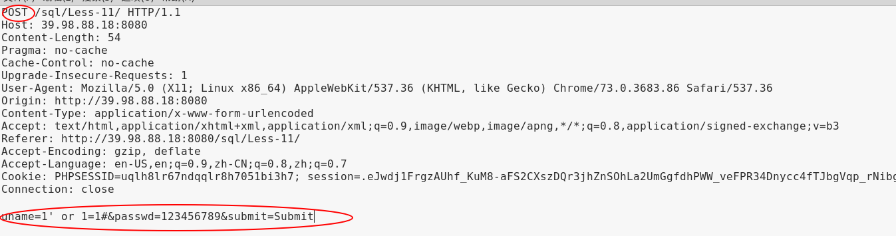
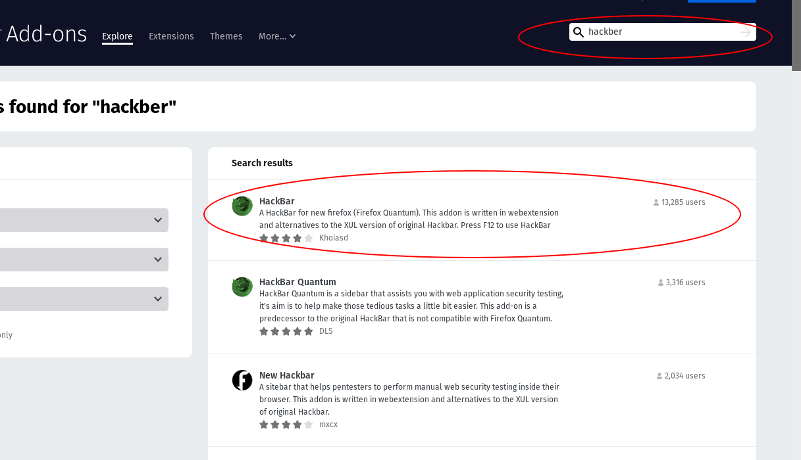
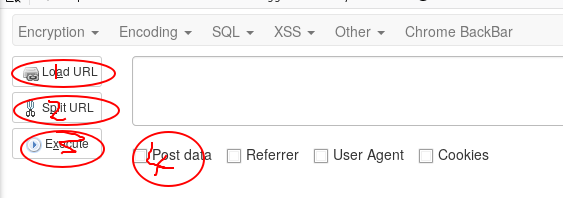

#sql注入之post注入

##一、免责声明

该课程中涉及的技术只适合于CTF比赛和有合法授权的渗透测试。请勿用于其他非法用途，如果作于其他非法用途，与本文作者无关。

##二、post方法

POST方法也与GET 方法类似,但是在一些地方也有区别。

1.GET方法没有请求内容，但是post方法是有请求内容的。POST的请求可以向服务器发送大量的信息。eg:文件上传。

2.虽然GET方法也可以传送数据，但是有长度的限制，而且get请求会将发送的数据明文显示出来。而post不会,所以安全性相对高一点。eg:账户密码登录。

post传输用户名密码的头部信息如下:



##三、实战链接

>http://39.98.88.18:8080/sql/Less-11/index.php

##四、火狐插件hacker

post注入需要修改post的消息体，而消息体使我们在正常的浏览过程中无法发现的。

此时，我们需要借助工具来使用，我们可以使用火狐浏览器的hackar,或者burpsuti等工具，在这里我们详细介绍hackbar

我们打开火狐浏览器，然后选中右上角的三个横线，然后选择Add-one,然后在右上方条框内输入

hackbar。然后我们选择第一个。



点击Add to Firefox.


此时hackbar插件安装完成，我们看一下如何使用。

我们按下F12,然后选择hackbar


然后我们介绍一下hackbar的简单的使用方法

```
1.Load URL：将当前浏览器的地址栏url复制到输入框中。

2.Split URL：按照&来分割提交参数，并且一个参数占一行。

3.Execute：提交请求。

4.post：用来发送post数据

```


接下来，我们需要在post的框中输入post的消息题，这里我们采用burpsuit来获取消息题。关于brupsuit的使用，在此不过多叙述。我们打开burpsuit，挂上代理，然后在username and password　的登录框中随便输入一些数据，然后点击submit.


我们成功捕获数据，我们将数据复制，然后粘贴进hackbar的post框中


然后我们可以通过修改uname 和　passwd 的值来实现注入

##五、原理精讲

首先我们看一下后台源码

```
	@$sql="SELECT username, password FROM users WHERE username='$uname' and password='$passwd' LIMIT 0,1";
	$result=mysql_query($sql);
	$row = mysql_fetch_array($result);
```
由后台源码可以得知，这里将我们输入的username and password　带入数据库中进行匹配，如果匹配成功。则登录成功。

我们可以输入以下代码
>admin1' or 1=1 #

>kdkdks(密码处可以随便输入)

讲我们输入的内容带入后台sql语句，语句如下：

>sql="SELECT username, password FROM users WHERE username='1' or 1=1#' and password='kdkdks' LIMIT 0,1"

我们发现＃注释掉了后面的代码，１or 1=1 我们可以得知，1=1恒为真，or两侧只有有一个为真结果即为真。

如果我们讲1' or 1=1 换成我们在get注入时的payload，我们便可以注入出数据。

##六、实战

POST注入可以分为两种，第一种可以绕过用户名密码验证，用来注入数据。

##第一种：绕过密码验证

绕过密码验证一般情况下需要结合网站后台的文件上传漏洞或者其他漏洞来获取shell.

一、判断闭合

1.我们在用户名的输入框中加入１'，然后在密码中随便输入。


2.发现其成功报错，分析报错语句时，可以发现是单引号闭合。然后我们进行绕过。

> 1' or 1=1 #
> 123456(此处可以随便输入)


绕过成功。


##第二种：注入数据

post注入数据与get注入数据的差异除了输入位置以外差别并不是很大。

1.判断闭合

输入单引号后报错，根据报错信息，证明其实单引号闭合。


2.判断列数


最后发现其有两列数据

3.查询数据名称


成功得出数据库名为security。

4.继续注入

剩下的注入方法与get字符型注入相同，请大家自行尝试。如有疑问的地方可以翻看我们之前的文档

>https://t.zsxq.com/ZFuRjqZ

或在知识星球内提问


##七、课后练习

POST注入之单引号闭合：https://t.zsxq.com/iIqzrBm

POST注入之双引号单括号闭合：https://t.zsxq.com/eA2fm2N

##八、小结
CTF（web和内网渗透系列教程）的清单请在“https://github.com/xuanhun/HackingResource” 查看，定时更新最新章节链接

答疑、辅导请加入玄魂工作室--安全圈，一起成长探讨更私密内容。微信扫码了解详情：


及时获取更多消息，请关注微信订阅号


