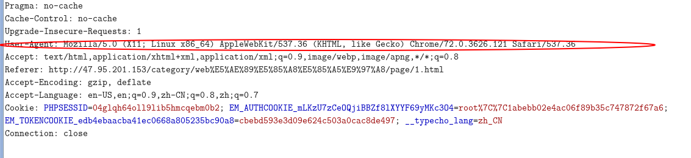
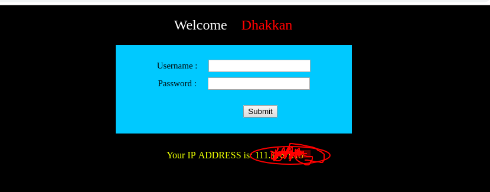

#2.5  sql注入useragent注入

##一、免责声明

该课程中涉及的技术只适合于CTF比赛和有合法授权的渗透测试。请勿用于其他非法用途，如果作于其他非法用途，与本文作者无关。

##二、User-Agent简介

User-Agent是Http协议中的一部分，属于头域的组成部分，User Agent也简称UA。用较为普通的一点来说，是一种向访问网站提供你所使用的浏览器类型、操作系统及版本、CPU 类型、浏览器渲染引擎、浏览器语言、浏览器插件等信息的标识。UA字符串在每次浏览器 HTTP 请求时发送到服务器！

在部分的网站中，会记录客户端使用的操作系统或浏览器版本等存入数据库。

##三、靶场地址

>http://39.98.88.18:8080/sql/Less-18/index.php

##四、实战

1.打开题目，发现下面显示着自己的ip地址，猜测与User-Agent有关。使用BrupSuit抓包。

2.

